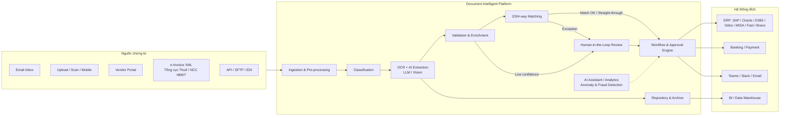

# Document Intelligent Platform — Requirements

Bộ tài liệu yêu cầu (Business + Software Requirements) cho hệ thống **Document Intelligent (DI)** giúp **Procurement / Purchasing team** và **Accounts Payable (AP)** quản lý **Invoice, Billing, Purchase Order** với năng lực **OCR + AI**, **Workflow Automation** và **Integration** với ERP / e-Invoice / hệ sinh thái doanh nghiệp.

> Phiên bản: v0.1 (Draft for review) · Ngày: 2026-09-26 · Trạng thái: Draft

## Mục lục tài liệu

| # | Tài liệu | Nội dung chính |
|---|----------|----------------|
| 01 | [Business Requirements](docs/01-business-requirements.md) | Bối cảnh, pain points, mục tiêu, KPI, phạm vi, stakeholders, personas, loại chứng từ |
| 02 | [Functional Requirements](docs/02-functional-requirements.md) | Yêu cầu chức năng chi tiết theo module (FR-xxx), mức ưu tiên MoSCoW |
| 03 | [AI & OCR Capabilities](docs/03-ai-ocr-capabilities.md) | Pipeline OCR/IDP, LLM extraction, confidence, HITL, AI Assistant, anomaly/fraud detection, AI governance |
| 04 | [Workflow Automation](docs/04-workflow-automation.md) | Workflow designer, rule engine, approval matrix, SLA/escalation, các workflow mẫu (P2P, invoice exception…) |
| 05 | [Integration Requirements](docs/05-integration-requirements.md) | ERP, e-Invoice (hóa đơn điện tử VN), email, banking, collaboration, API/Webhook, connector framework |
| 06 | [Non-Functional Requirements](docs/06-non-functional-requirements.md) | Performance, scalability, availability, security, compliance (VN & quốc tế), observability |
| 07 | [Data Model](docs/07-data-model.md) | Thực thể dữ liệu chính, trường dữ liệu trích xuất, trạng thái chứng từ |
| 08 | [User Stories & Acceptance Criteria](docs/08-user-stories.md) | User stories theo persona với acceptance criteria (Gherkin) |
| 09 | [Roadmap, Risks & Open Questions](docs/09-roadmap-risks.md) | Phân pha release (MVP → Scale), rủi ro, giả định, câu hỏi mở cần làm rõ với khách hàng |
| 10 | [Solution Architecture & Tech Stack](docs/10-solution-architecture.md) | Kiến trúc tổng thể, pipeline xử lý, workflow engine (bpmn-js), AI/LLM strategy, tech stack, deployment, ADR, PoC plan |

## Tóm tắt giải pháp (Executive Summary)

**Giá trị cốt lõi**

- **Touchless processing**: ≥ 70% invoice được xử lý tự động (straight-through) không cần can thiệp thủ công sau 6 tháng vận hành.
- **Giảm cycle time**: từ trung bình 7–10 ngày xuống ≤ 2 ngày cho invoice-to-approval.
- **Giảm chi phí xử lý**: giảm ≥ 60% chi phí/invoice.
- **Kiểm soát & tuân thủ**: phát hiện duplicate, sai lệch giá/số lượng, hóa đơn không hợp lệ, gian lận nhà cung cấp; audit trail đầy đủ; lưu trữ theo Luật Kế toán.
- **Mở & tích hợp**: API-first, connector cho ERP phổ biến tại Việt Nam và quốc tế, workflow cấu hình được (low-code) không cần lập trình.

## Quy ước

- **Mã yêu cầu**: `BR-` (business), `FR-<MODULE>-nnn` (functional), `NFR-<CAT>-nnn` (non-functional), `INT-` (integration), `AI-` (AI/OCR), `WF-` (workflow).
- **Mức ưu tiên (MoSCoW)**: **M** = Must have (MVP), **S** = Should have, **C** = Could have, **W** = Won't have (lần này).
- Thuật ngữ: xem [Glossary](docs/01-business-requirements.md#10-glossary).
