# 01. Business Requirements

## 1. Bối cảnh (Background)

Procurement / Purchasing team và Accounts Payable (AP) hàng tháng xử lý hàng nghìn chứng từ từ nhiều nhà cung cấp (vendor): **Purchase Order (PO)**, **Quotation**, **Contract**, **Delivery Note / Goods Received Note (GRN)**, **Invoice / Hóa đơn GTGT**, **Billing Statement**, **Credit/Debit Note**, **Receipt**. Chứng từ đến qua nhiều kênh (email, giấy, file PDF scan, XML hóa đơn điện tử, portal nhà cung cấp) với định dạng không đồng nhất, đa ngôn ngữ (Việt, Anh, Trung, Nhật, Hàn…).

### 1.1 Pain points hiện tại

| # | Pain point | Tác động |
|---|-----------|----------|
| P1 | Nhập liệu thủ công từ PDF/giấy vào ERP | Tốn 5–15 phút/invoice, sai sót 2–5% |
| P2 | Đối chiếu PO – GRN – Invoice bằng Excel | Chậm thanh toán, mất chiết khấu thanh toán sớm, phạt trễ hạn |
| P3 | Approval qua email / giấy, không theo dõi được trạng thái | Cycle time 7–10 ngày, thất lạc chứng từ |
| P4 | Không phát hiện được invoice trùng, sai giá, vendor giả mạo | Rủi ro thất thoát tài chính, gian lận |
| P5 | Hóa đơn điện tử cần kiểm tra tính hợp lệ (MST, chữ ký số, trạng thái trên cổng Thuế) thủ công | Rủi ro bị loại chi phí khi quyết toán thuế |
| P6 | Chứng từ lưu trữ phân tán (email, ổ chia sẻ, tủ hồ sơ) | Khó tra cứu khi audit, không đáp ứng yêu cầu lưu trữ 10 năm |
| P7 | Không có dữ liệu spend analytics theo vendor/category/cost center | Khó đàm phán, khó kiểm soát ngân sách |
| P8 | Vendor liên tục hỏi trạng thái thanh toán qua email/điện thoại | Tốn thời gian AP team |

## 2. Mục tiêu kinh doanh (Business Objectives)

| ID | Mục tiêu | KPI | Baseline (giả định) | Target (12 tháng) |
|----|----------|-----|---------------------|-------------------|
| BR-01 | Tự động hóa thu thập & trích xuất dữ liệu chứng từ | Field-level extraction accuracy | N/A (manual) | ≥ 95% header, ≥ 90% line items |
| BR-02 | Tăng tỷ lệ xử lý không chạm (touchless) | Straight-through processing rate | 0% | ≥ 70% |
| BR-03 | Rút ngắn chu trình Invoice-to-Approval | Avg. cycle time | 7–10 ngày | ≤ 2 ngày |
| BR-04 | Giảm chi phí xử lý | Cost per invoice | 100% | −60% |
| BR-05 | Kiểm soát rủi ro & gian lận | Duplicate / overpayment bị chặn | Không đo được | ≥ 99% duplicate bị phát hiện trước khi thanh toán |
| BR-06 | Tuân thủ thuế & kế toán | % hóa đơn điện tử được xác thực tự động | ~0% | 100% |
| BR-07 | Tăng khả năng quan sát (visibility) | % chứng từ có trạng thái real-time | < 20% | 100% |
| BR-08 | Tối ưu dòng tiền | % early-payment discount được hưởng | Thấp | +50% so với baseline |
| BR-09 | Cải thiện trải nghiệm nhà cung cấp | Số inquiry về trạng thái thanh toán | 100% | −70% (qua Vendor Portal) |

## 3. Phạm vi (Scope)

### 3.1 In-scope

1. **Document Ingestion** đa kênh: email, upload (web/mobile), scan, e-Invoice XML, API, SFTP, Vendor Portal.
2. **OCR & AI Extraction** cho các loại chứng từ procurement: PO, Quotation, Contract, GRN/Delivery Note, Invoice, Billing Statement, Credit/Debit Note, Receipt.
3. **Validation & Enrichment**: business rules, tax validation, vendor master lookup, GL/cost center coding suggestion.
4. **Matching**: 2-way (PO–Invoice), 3-way (PO–GRN–Invoice), 4-way (PO–GRN–Inspection–Invoice), với tolerance cấu hình được.
5. **Human-in-the-Loop (HITL) Review** workspace.
6. **Workflow Automation**: visual workflow designer, rule engine, approval matrix, SLA, escalation, delegation.
7. **Purchase Order & Billing management**: theo dõi PO lifecycle, billing schedule, recurring billing/subscription, contract compliance.
8. **AI Assistant**: hỏi đáp trên chứng từ (chat with documents), tóm tắt hợp đồng, anomaly & fraud detection, spend insights.
9. **Integration**: ERP, e-Invoice providers, cổng tra cứu hóa đơn của cơ quan Thuế, email, banking, Teams/Slack, BI; REST API & Webhooks.
10. **Vendor Portal**: nộp invoice, theo dõi trạng thái, cập nhật thông tin vendor.
11. **Reporting & Analytics**: operational dashboard, spend analytics, AP aging, KPI.
12. **Document Repository & Archive**: full-text search, versioning, retention policy, legal hold.
13. **Administration**: multi-tenant / multi-entity, RBAC, cấu hình document types, audit log.

### 3.2 Out-of-scope (giai đoạn này)

- Thực hiện **thanh toán** trực tiếp (chỉ tạo payment proposal/file và tích hợp với banking/ERP; việc chuyển tiền do ngân hàng/ERP thực hiện).
- **Sourcing / e-Tendering / RFQ auction** đầy đủ (chỉ trích xuất & so sánh quotation).
- Thay thế **ERP** (hệ thống không phải general ledger).
- **Phát hành** hóa đơn điện tử đầu ra (sales invoice) — chỉ xử lý hóa đơn đầu vào.
- Quản lý kho (inventory management).

## 4. Stakeholders

| Stakeholder | Vai trò | Quan tâm chính |
|-------------|---------|----------------|
| CFO / Finance Director | Sponsor | ROI, kiểm soát chi phí, tuân thủ, dòng tiền |
| Head of Procurement | Business owner | Hiệu quả mua hàng, quản lý vendor, spend visibility |
| AP Manager | Business owner | Tốc độ xử lý invoice, độ chính xác, đóng sổ đúng hạn |
| Chief Accountant (Kế toán trưởng) | Key user / approver | Tính hợp lệ chứng từ, thuế, lưu trữ |
| IT / Enterprise Architect | Technical owner | Integration, security, vận hành |
| Internal Audit / Compliance | Reviewer | Audit trail, segregation of duties (SoD), fraud control |
| Vendors / Suppliers | External user | Nộp chứng từ dễ dàng, minh bạch trạng thái thanh toán |
| Budget owners / Department heads | Approver | Phê duyệt nhanh, kiểm soát ngân sách |

## 5. Personas & Roles

| Role | Mô tả | Chức năng chính trên hệ thống |
|------|-------|-------------------------------|
| **Buyer / Procurement Officer** | Tạo & theo dõi PO, làm việc với vendor | Upload quotation/contract, so sánh báo giá, theo dõi PO status, xử lý price/quantity exception |
| **Requester** | Nhân viên phòng ban có nhu cầu mua | Xác nhận nhận hàng (GRN/service entry), xem trạng thái yêu cầu |
| **AP Clerk** | Xử lý invoice | Review extraction, xử lý exception, coding GL, gửi duyệt, đẩy ERP |
| **AP Manager** | Quản lý AP team | Giám sát queue, SLA, phân công, báo cáo, cấu hình tolerance |
| **Approver** (Line manager, Budget owner, Director) | Phê duyệt theo ma trận | Approve/Reject/Request info trên web, mobile, email, Teams/Slack |
| **Finance Controller / Chief Accountant** | Kiểm soát tài chính | Duyệt cuối, kiểm tra thuế, tạo payment proposal, đối soát |
| **Vendor User** | Người dùng nhà cung cấp | Nộp invoice, PO flip, xem trạng thái thanh toán, cập nhật hồ sơ |
| **Auditor** | Kiểm toán nội bộ/độc lập | Read-only truy cập chứng từ, audit trail, báo cáo |
| **Business Admin** | Quản trị nghiệp vụ | Cấu hình document types, rules, workflows, approval matrix, templates |
| **System Admin** | Quản trị hệ thống | User, SSO, integration, API keys, monitoring |

## 6. Loại chứng từ hỗ trợ (Document Types)

| Document type | Định dạng đầu vào | Trường dữ liệu chính (tóm tắt) | Ưu tiên |
|---------------|-------------------|--------------------------------|---------|
| **Invoice (Hóa đơn GTGT / Hóa đơn bán hàng)** | XML HĐĐT, PDF (native/scan), ảnh | Ký hiệu mẫu số, ký hiệu hóa đơn, số hóa đơn, ngày, mã CQT, MST bán/mua, line items, thuế suất, tiền thuế, tổng tiền | M |
| **Commercial Invoice (nước ngoài)** | PDF, ảnh | Invoice no., date, vendor, PO ref, currency, Incoterms, line items, tax/VAT, total, bank details | M |
| **Purchase Order** | PDF, ERP data, Excel | PO no., date, vendor, delivery date, line items, unit price, payment terms | M |
| **Delivery Note / GRN** | PDF, ảnh, ERP data | GRN no., PO ref, date, received qty, người nhận, chữ ký | M |
| **Credit / Debit Note** | XML, PDF | Ref invoice, lý do điều chỉnh, số tiền | M |
| **Billing Statement / Statement of Account** | PDF, Excel | Kỳ, danh sách invoice, số dư, aging | S |
| **Quotation / Proposal** | PDF, Excel, Word | Vendor, validity, line items, unit price, terms | S |
| **Contract / Framework Agreement** | PDF, Word | Parties, effective/expiry date, giá trị, price list, payment terms, penalty, auto-renewal, SLA | S |
| **Receipt / Expense bill** | Ảnh, PDF | Merchant, date, amount, tax | C |
| **Customs declaration (Tờ khai HQ)** | PDF, XML | Số tờ khai, ngày, thuế NK, VAT hàng nhập | C |
| **Custom / user-defined type** | Bất kỳ | Định nghĩa bởi Business Admin (schema-based) | S |

## 7. Business Process tổng quan (Procure-to-Pay)

```mermaid
flowchart LR
    PR[Purchase Requisition] --> PO[Purchase Order]
    PO --> ACK[Vendor Acknowledgement]
    ACK --> GR[Goods / Service Receipt]
    GR --> INV[Invoice Received]
    INV --> CAP[Capture & Extract]
    CAP --> VAL[Validate]
    VAL --> MATCH[Match PO/GRN/Invoice]
    MATCH --> APPR[Approval]
    APPR --> POST[Post to ERP]
    POST --> PAY[Payment Proposal]
    PAY --> REC[Payment & Reconciliation]
    REC --> ARCH[Archive]
```

Phạm vi DI tập trung từ bước **INV → ARCH**, đồng thời quản lý/đồng bộ dữ liệu **PO, GRN, Contract** để phục vụ matching và kiểm soát.

## 8. Business Rules chính (tóm tắt)

| ID | Business rule |
|----|---------------|
| BRL-01 | Invoice có PO phải được match với PO (và GRN nếu là hàng hóa) trước khi duyệt thanh toán. |
| BRL-02 | Invoice không PO (non-PO invoice) phải được gán cost center/GL và đi qua approval theo ma trận ngưỡng giá trị. |
| BRL-03 | Sai lệch trong tolerance (ví dụ ±2% hoặc ±500.000 VND về giá, ±5% về số lượng) được auto-approve matching; ngoài tolerance → exception. |
| BRL-04 | Hóa đơn điện tử phải hợp lệ: đúng cấu trúc XML, chữ ký số hợp lệ, MST người bán đang hoạt động, hóa đơn tồn tại và có trạng thái hợp lệ trên cổng tra cứu của cơ quan Thuế. |
| BRL-05 | Không thanh toán trùng: cùng vendor + số hóa đơn + ký hiệu + số tiền (hoặc fuzzy match) → block. |
| BRL-06 | Thay đổi thông tin tài khoản ngân hàng của vendor phải được xác minh bởi 2 người (4-eyes) trước khi có hiệu lực. |
| BRL-07 | Segregation of Duties: người tạo PO không được approve invoice của PO đó; người nhập vendor không được approve payment. |
| BRL-08 | Hóa đơn giá trị ≥ 20.000.000 VND phải thanh toán không dùng tiền mặt để đủ điều kiện khấu trừ thuế GTGT đầu vào (cảnh báo khi phương thức thanh toán không phù hợp; ngưỡng cấu hình được theo quy định hiện hành). |
| BRL-09 | Chứng từ kế toán phải được lưu trữ tối thiểu 10 năm (theo Luật Kế toán); không được xóa vật lý trước hạn. |
| BRL-10 | Invoice vượt giá trị còn lại của PO / contract hoặc ngân sách → cảnh báo và yêu cầu approval bổ sung. |

## 9. Success Criteria cho dự án

1. Go-live MVP trong vòng 4–5 tháng kể từ kick-off.
2. Đạt accuracy target (BR-01) trên tập UAT gồm tối thiểu 1.000 chứng từ thực tế của khách hàng.
3. Tích hợp 2 chiều thành công với ERP chính của khách hàng (master data in, posting out).
4. ≥ 90% người dùng AP/Procurement được đào tạo và sử dụng hệ thống sau 1 tháng go-live.
5. Không có lỗi Severity 1 mở trong 30 ngày hypercare.

## 10. Glossary

| Thuật ngữ | Giải thích |
|-----------|-----------|
| **IDP** | Intelligent Document Processing — xử lý chứng từ thông minh kết hợp OCR, ML, LLM |
| **OCR / ICR** | Optical / Intelligent Character Recognition — nhận dạng ký tự in / viết tay |
| **HITL** | Human-in-the-Loop — con người kiểm tra/hiệu chỉnh kết quả AI |
| **STP** | Straight-Through Processing — xử lý tự động hoàn toàn không cần can thiệp |
| **P2P** | Procure-to-Pay |
| **AP** | Accounts Payable — công nợ phải trả |
| **GRN** | Goods Received Note — phiếu nhập kho / biên bản nhận hàng |
| **2/3/4-way matching** | Đối chiếu PO–Invoice / PO–GRN–Invoice / PO–GRN–Inspection–Invoice |
| **HĐĐT** | Hóa đơn điện tử |
| **MST** | Mã số thuế |
| **Mã CQT** | Mã của cơ quan Thuế cấp cho hóa đơn điện tử có mã |
| **SoD** | Segregation of Duties — phân tách nhiệm vụ |
| **GL / Cost center** | Tài khoản sổ cái / Trung tâm chi phí |
| **SLA** | Service Level Agreement — thời hạn xử lý cam kết |
| **LLM** | Large Language Model |
| **RAG** | Retrieval-Augmented Generation |
| **PO flip** | Vendor tạo invoice trực tiếp từ PO trên Vendor Portal |
