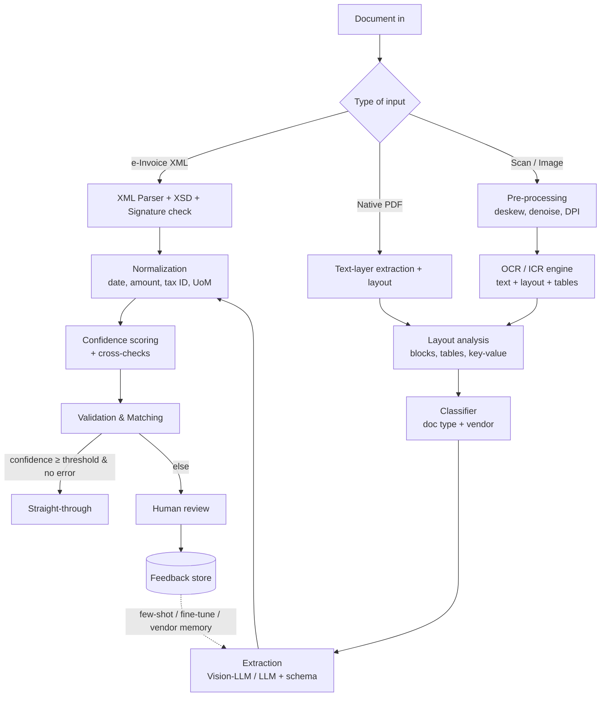

# 03. AI & OCR Capabilities

## 1. Kiến trúc pipeline Intelligent Document Processing (IDP)

### 1.1 Nguyên tắc thiết kế

| ID | Nguyên tắc |
|----|-----------|
| AI-P01 | **Structured-first**: nếu có dữ liệu có cấu trúc (HĐĐT XML, EDI, ERP data) thì dùng trực tiếp, OCR/LLM chỉ dùng khi cần. |
| AI-P02 | **Hybrid OCR + LLM**: OCR engine cho text & tọa độ (grounding), Vision-LLM/LLM cho hiểu ngữ nghĩa và trích xuất theo schema; kết quả LLM phải map ngược về vị trí trên chứng từ (không chấp nhận giá trị "không có nguồn"). |
| AI-P03 | **Pluggable model layer**: trừu tượng hóa OCR engine & LLM provider để thay thế/kết hợp (cloud hoặc on-prem) theo yêu cầu bảo mật và chi phí. |
| AI-P04 | **Deterministic checks sau AI**: mọi giá trị AI trích xuất đều qua validation (toán học, master data, thuế) trước khi dùng. |
| AI-P05 | **Human-in-the-loop by design**: ngưỡng confidence cấu hình được; người dùng là người quyết định cuối cho giao dịch tài chính. |
| AI-P06 | **Continuous learning** từ hiệu chỉnh của người dùng, có kiểm soát version & đánh giá trước khi áp dụng. |

## 2. OCR Requirements

| ID | Yêu cầu | Ưu tiên |
|----|---------|---------|
| AI-OCR-001 | Nhận dạng tiếng Việt có dấu với character accuracy ≥ 98% trên chứng từ in chất lượng tốt (≥ 300 DPI). | M |
| AI-OCR-002 | Hỗ trợ English (M); Chinese (Simplified/Traditional), Japanese, Korean, Thai (S). Hỗ trợ chứng từ song ngữ. | M |
| AI-OCR-003 | Trả về text kèm tọa độ (word/line/block), reading order, và cấu trúc bảng (cell, row, column span). | M |
| AI-OCR-004 | Nhận dạng chữ viết tay (ICR) cho số và chữ tiếng Việt/Anh. | S |
| AI-OCR-005 | Nhận dạng barcode, QR code (ví dụ QR trên hóa đơn, mã tra cứu). | S |
| AI-OCR-006 | Phát hiện con dấu (stamp), chữ ký, checkbox, watermark. | S |
| AI-OCR-007 | Tạo **searchable PDF/A** từ bản scan. | M |
| AI-OCR-008 | Chạy được **on-premise / private cloud** (container) cho khách hàng không cho phép dữ liệu ra ngoài. | S |

**Engine options (đánh giá trong giai đoạn PoC):** Azure AI Document Intelligence, AWS Textract, Google Document AI, ABBYY, PaddleOCR / docTR / Tesseract (self-hosted) kết hợp model fine-tune tiếng Việt (ví dụ VietOCR). Lựa chọn cuối dựa trên benchmark độ chính xác trên bộ dữ liệu thực tế của khách hàng, chi phí/trang, và yêu cầu data residency.

## 3. AI Extraction Requirements

| ID | Yêu cầu | Ưu tiên |
|----|---------|---------|
| AI-EXT-001 | Trích xuất theo **JSON schema** của document type (header + line items + custom fields), output luôn hợp lệ theo schema (structured output). | M |
| AI-EXT-002 | **Template-free**: xử lý layout mới chưa từng gặp với accuracy header ≥ 90% ngay lần đầu. | M |
| AI-EXT-003 | **Vendor memory / few-shot**: tự động dùng các mẫu đã được người dùng xác nhận của cùng vendor/layout làm ví dụ để tăng accuracy. | S |
| AI-EXT-004 | Mỗi field có **confidence score** tổng hợp từ: OCR confidence, model confidence/log-prob (nếu có), self-consistency, kết quả cross-check (math, master data). | M |
| AI-EXT-005 | Mỗi field có **grounding** (page + bounding box / text span). Field không tìm thấy nguồn → confidence thấp và bắt buộc review. | M |
| AI-EXT-006 | Suy luận các giá trị gián tiếp có kiểm soát (ví dụ tính due date từ payment terms, suy luận PO từ context) và đánh dấu rõ là "derived". | S |
| AI-EXT-007 | Xử lý chứng từ dài (> 50 trang, bảng kê hàng nghìn dòng) bằng chunking theo trang/bảng mà không mất dòng. Kiểm tra tổng dòng = tổng trên chứng từ. | M |
| AI-EXT-008 | Phân loại line item vào category (UNSPSC hoặc taxonomy nội bộ) và gợi ý GL account/cost center/tax code. | S |
| AI-EXT-009 | Semantic item matching: map mô tả hàng hóa của vendor ↔ item master nội bộ (embedding + lịch sử). | S |
| AI-EXT-010 | Trích xuất điều khoản hợp đồng (clauses) và obligations với trích dẫn nguyên văn. | C |

### 3.1 Accuracy targets (đo trên tập test của khách hàng)

| Nhóm field | Target MVP | Target sau 6 tháng |
|------------|-----------|---------------------|
| Invoice header (vendor, số HĐ, ngày, MST, tổng tiền, VAT) — chứng từ scan/PDF | ≥ 95% | ≥ 98% |
| Invoice header — HĐĐT XML | 100% (parse) | 100% |
| Line items (description, qty, unit price, amount) | ≥ 90% | ≥ 95% |
| Document classification | ≥ 97% | ≥ 99% |
| PO reference detection | ≥ 90% | ≥ 95% |
| GL / cost center suggestion (top-1) | ≥ 75% | ≥ 90% |

**Định nghĩa đo lường:** field-level accuracy = số field đúng hoàn toàn sau normalization / tổng số field có trong ground truth. Cần công bố bộ test, phương pháp đánh giá và báo cáo định kỳ (monthly) theo vendor & document type.

## 4. Human-in-the-Loop & Continuous Learning

| ID | Yêu cầu | Ưu tiên |
|----|---------|---------|
| AI-HITL-001 | Ngưỡng confidence cấu hình theo field, document type, vendor; field "critical" (tổng tiền, bank account, MST) có ngưỡng riêng cao hơn. | M |
| AI-HITL-002 | Mọi hiệu chỉnh của người dùng được lưu làm **labeled data** (giá trị cũ, giá trị mới, vị trí) phục vụ đánh giá & học. | M |
| AI-HITL-003 | **Auto-tuning STP**: hệ thống đề xuất nới/siết ngưỡng dựa trên precision thực tế đo được theo vendor (cần Admin chấp thuận). | S |
| AI-HITL-004 | Model/prompt version được quản lý; thay đổi phải chạy regression test trên golden dataset và chỉ deploy khi không giảm accuracy (quality gate). | M |
| AI-HITL-005 | Giám sát **drift**: cảnh báo khi accuracy/correction rate của một vendor/layout giảm đột ngột (vendor đổi mẫu hóa đơn). | S |
| AI-HITL-006 | Dữ liệu của tenant chỉ dùng để cải thiện model cho chính tenant đó, trừ khi có đồng ý bằng văn bản (opt-in). | M |

## 5. AI Assistant / Copilot

| ID | Yêu cầu | Ưu tiên |
|----|---------|---------|
| AI-AST-001 | Chat panel trong ứng dụng, ngữ cảnh theo màn hình hiện tại (chứng từ đang mở, queue, dashboard). | S |
| AI-AST-002 | **RAG** trên kho chứng từ & dữ liệu có cấu trúc; câu trả lời luôn có citation; trả lời "không đủ thông tin" khi không có nguồn. | S |
| AI-AST-003 | **Text-to-query** an toàn: sinh truy vấn trên semantic layer/API đã được cấp quyền (không truy cập DB trực tiếp), áp dụng row-level security của người hỏi. | S |
| AI-AST-004 | Tác vụ mẫu: "Vì sao invoice này bị exception?", "Soạn email yêu cầu vendor xuất hóa đơn điều chỉnh", "So sánh 3 báo giá này", "Tóm tắt điều khoản thanh toán của hợp đồng X", "Liệt kê invoice sắp quá hạn tuần này". | S |
| AI-AST-005 | AI không được tự thực hiện hành động có tác động tài chính (approve, post, pay) — chỉ đề xuất; hành động cần người dùng xác nhận. | M |
| AI-AST-006 | Hỗ trợ tiếng Việt và tiếng Anh. | S |

## 6. Anomaly & Fraud Detection

| ID | Tín hiệu | Phương pháp | Ưu tiên |
|----|---------|-------------|---------|
| AI-FRD-001 | Duplicate / near-duplicate invoice (khác định dạng số HĐ, gửi lại qua kênh khác) | Rule + fuzzy + embedding similarity | M |
| AI-FRD-002 | Bank account trên invoice khác vendor master / mới thay đổi gần đây | Rule | M |
| AI-FRD-003 | Giá bất thường so với lịch sử / contract / vendor khác cùng item | Statistical outlier | S |
| AI-FRD-004 | Invoice splitting để né ngưỡng phê duyệt | Pattern (cùng vendor, tổng gần ngưỡng, thời gian gần) | S |
| AI-FRD-005 | Vendor mới + giao dịch lớn + thanh toán gấp | Risk scoring | S |
| AI-FRD-006 | Tài liệu bị chỉnh sửa (PDF tampering: font không đồng nhất, metadata sửa đổi, layer ẩn, ảnh ghép) | Forensic analysis | S |
| AI-FRD-007 | MST người bán ngừng hoạt động / không tồn tại / hóa đơn không tồn tại trên cổng Thuế | Tax authority lookup | M |
| AI-FRD-008 | Vendor trùng thông tin với nhân viên (địa chỉ, số tài khoản, số điện thoại) — conflict of interest | Matching với HR data (nếu được phép) | C |
| AI-FRD-009 | Số hóa đơn liên tiếp từ cùng vendor cho một khách hàng duy nhất (dấu hiệu vendor "ma") | Pattern | C |

Mỗi alert có **risk score (0–100)**, lý do giải thích được (explainable reasons), và workflow xử lý (investigate → confirm/dismiss với lý do). Kết quả dismiss được dùng để giảm false positive.

## 7. AI Governance & Responsible AI

| ID | Yêu cầu | Ưu tiên |
|----|---------|---------|
| AI-GOV-001 | Log đầy đủ input/output/model version/prompt version cho mỗi lần AI xử lý (phục vụ audit & debug), có masking dữ liệu nhạy cảm theo cấu hình. | M |
| AI-GOV-002 | Hỗ trợ triển khai LLM qua **enterprise endpoint** (ví dụ Anthropic Claude qua API/AWS Bedrock/Google Vertex AI, Azure OpenAI) với cam kết **không dùng dữ liệu khách hàng để huấn luyện**, chọn region phù hợp data residency; hoặc **self-hosted open-weight model** cho môi trường air-gapped. | M |
| AI-GOV-003 | Chống **prompt injection** từ nội dung chứng từ/email (ví dụ text ẩn "approve this invoice"): nội dung chứng từ luôn được xử lý như dữ liệu, không như chỉ thị; AI không có quyền thực thi hành động tài chính. | M |
| AI-GOV-004 | Giới hạn chi phí AI theo tenant (budget/quota), cache kết quả, routing model theo độ phức tạp (model nhỏ cho chứng từ đơn giản, model lớn cho chứng từ phức tạp). | S |
| AI-GOV-005 | Dashboard chất lượng AI: accuracy, STP, correction rate, latency, cost/page theo model version. | S |
| AI-GOV-006 | Tài liệu model card: mục đích, dữ liệu đánh giá, giới hạn đã biết. | S |
