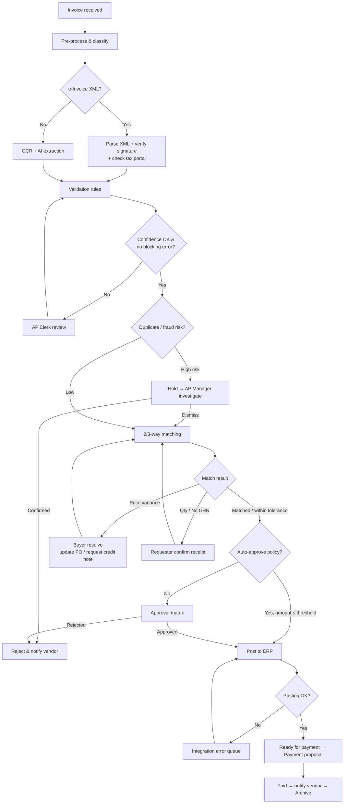
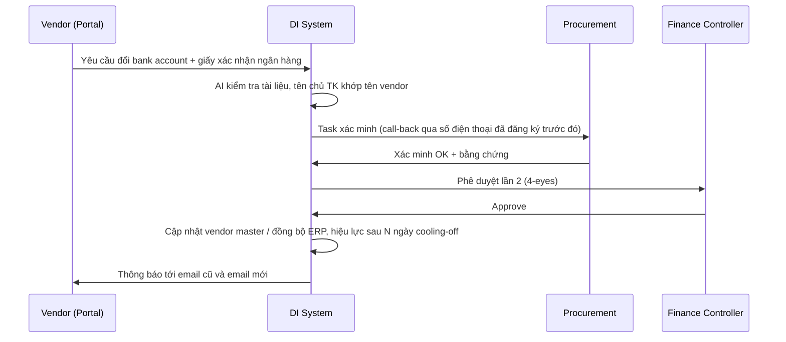

# 04. Workflow Automation

## 1. Workflow Engine Requirements

| ID | Yêu cầu | Ưu tiên |
|----|---------|---------|
| WF-001 | **Visual workflow designer** (low-code, kéo thả) cho Business Admin: nodes gồm Start/Trigger, Task (human), Automated action, Decision (condition), Parallel split/join, Timer, Sub-workflow, AI step, Integration call, End. | M |
| WF-002 | Workflow được **version hóa**; chứng từ đang chạy tiếp tục theo version cũ, chứng từ mới dùng version mới; hỗ trợ rollback. | M |
| WF-003 | **Triggers**: document received, status changed, extraction completed, validation failed, match exception, scheduled (cron), API/webhook call, ERP event. | M |
| WF-004 | **Rule engine / decision table** (no-code) với điều kiện trên mọi field của chứng từ, vendor, PO, user (ví dụ `amount > 100.000.000 AND category = 'IT'`). Hỗ trợ DMN-like decision tables. | M |
| WF-005 | **Automated actions**: gán người xử lý, đặt trạng thái, cập nhật field, gọi API/connector, gửi thông báo/email template, tạo task, chạy AI step (classify, summarize, draft email), post ERP, tạo payment proposal. | M |
| WF-006 | **Simulation / test mode**: chạy thử workflow với chứng từ mẫu trước khi publish; hiển thị đường đi (path) và kết quả từng node. | S |
| WF-007 | **Workflow templates** dựng sẵn: Invoice PO-based, Invoice non-PO, Credit note, Vendor onboarding, Bank account change, Contract renewal, Payment proposal approval, Dispute. | M |
| WF-008 | Khả năng **retry/compensation** khi bước tích hợp lỗi; dead-letter queue và màn hình xử lý lỗi cho Admin. | M |
| WF-009 | Theo dõi **process monitoring**: xem chứng từ đang ở bước nào, thời gian ở mỗi bước, bottleneck (process mining cơ bản). | S |
| WF-010 | **Custom forms** cho human task (cấu hình field hiển thị/bắt buộc theo bước). | S |
| WF-011 | Script/expression có kiểm soát (sandboxed, ví dụ JavaScript/JSONata) cho tính toán nâng cao. | C |

## 2. Approval Management

| ID | Yêu cầu | Ưu tiên |
|----|---------|---------|
| WF-APR-001 | **Approval matrix** cấu hình theo: legal entity, cost center, department, category, vendor, amount thresholds, document type, project. | M |
| WF-APR-002 | Kiểu phê duyệt: sequential, parallel (all / any / quorum N-of-M), hierarchical (theo org chart đến cấp đủ thẩm quyền — delegation of authority), dynamic (từ field: budget owner, PO creator, requester). | M |
| WF-APR-003 | Đồng bộ **org chart / reporting line** từ HRIS/Azure AD. | S |
| WF-APR-004 | **Delegation / Out-of-office**: người duyệt ủy quyền theo khoảng thời gian, phạm vi (amount, entity); lưu vết người duyệt thay. | M |
| WF-APR-005 | Actions: Approve, Reject (bắt buộc lý do), Return for correction, Request more info, Forward/Reassign (có quyền), Approve with comment. | M |
| WF-APR-006 | Phê duyệt trên **mobile**, **email actionable**, **Microsoft Teams / Slack** adaptive cards; hiển thị tóm tắt, ảnh chứng từ, kết quả matching, AI risk flags. | S |
| WF-APR-007 | **Bulk approval** cho các invoice đã match hoàn toàn, rủi ro thấp. | S |
| WF-APR-008 | Kiểm tra **SoD** khi route: không route cho người đã tạo/sửa dữ liệu chứng từ hoặc người tạo PO (BRL-07). | M |
| WF-APR-009 | Chữ ký số / e-signature cho bước phê duyệt cuối (tích hợp CA/remote signing) khi khách hàng yêu cầu. | C |

## 3. SLA & Escalation

| ID | Yêu cầu | Ưu tiên |
|----|---------|---------|
| WF-SLA-001 | Định nghĩa SLA theo bước/workflow/priority (theo giờ làm việc, lịch nghỉ lễ Việt Nam cấu hình được). | M |
| WF-SLA-002 | Nhắc nhở trước hạn (ví dụ còn 25% thời gian), escalation khi quá hạn (lên cấp trên / nhóm backup / auto-reassign). | M |
| WF-SLA-003 | Ưu tiên (priority) tự động theo due date, early-payment discount, vendor chiến lược. | S |
| WF-SLA-004 | Báo cáo SLA compliance theo user/team/step. | M |

## 4. Workflow mẫu

### 4.1 Invoice processing (PO-based) — End-to-end

### 4.2 Non-PO invoice

1. Capture & validate như 4.1.
2. AI gợi ý **GL account, cost center, tax code** dựa trên vendor & lịch sử → AP Clerk xác nhận.
3. Route tới **budget owner** của cost center → approval matrix theo amount.
4. Post ERP → payment.
5. Báo cáo "maverick spend" gửi Procurement nếu vendor/category lẽ ra phải có PO.

### 4.3 Price variance exception

| Bước | Actor | Hành động | SLA |
|------|-------|-----------|-----|
| 1 | System | Phát hiện `PRICE_VAR` ngoài tolerance, AI giải thích nguyên nhân khả dĩ (contract price change, PO chưa update, sai đơn vị tính) | Tức thời |
| 2 | Buyer | Chọn: (a) Chấp nhận & cập nhật PO, (b) Yêu cầu vendor credit note/hóa đơn điều chỉnh, (c) Reject | 2 ngày làm việc |
| 3a | System | Cập nhật PO trên ERP (hoặc tạo task cho người có quyền) → re-match | — |
| 3b | System | Gửi email (AI draft, Buyer duyệt) cho vendor; invoice ở trạng thái `ON_HOLD_VENDOR` | Chờ vendor, nhắc sau 3 ngày |
| 4 | System | Nhận credit note/hóa đơn điều chỉnh → liên kết → re-match | — |

### 4.4 Vendor bank account change (anti-fraud)

### 4.5 Recurring billing check

- Lịch hằng tháng: với mỗi recurring billing schedule (điện, nước, thuê văn phòng, SaaS…) kiểm tra đã nhận invoice của kỳ chưa.
- Chưa nhận sau `expected_date + N ngày` → nhắc vendor/owner.
- Nhận được: so sánh số tiền với kỳ trước/trung bình 6 kỳ; biến động > X% → gắn cờ review; trong ngưỡng → auto-approve theo policy.

### 4.6 Contract renewal & consumption

- Trigger 90/60/30 ngày trước ngày hết hạn → task cho contract owner: Renew / Renegotiate / Terminate.
- Consumption ≥ 80% giá trị hợp đồng → cảnh báo Procurement; ≥ 100% → chặn auto-approve invoice liên quan.

## 5. Automation Levels (cấu hình theo tenant/vendor)

| Level | Mô tả | Điều kiện áp dụng gợi ý |
|-------|-------|-------------------------|
| L0 – Assisted | AI trích xuất, người dùng review toàn bộ | Giai đoạn đầu go-live, vendor mới |
| L1 – Exception-based | Chỉ review field confidence thấp / có lỗi | Mặc định sau khi đạt accuracy target |
| L2 – Touchless capture | Không review nếu pass validation & match; vẫn qua approval | Vendor có lịch sử accuracy ≥ 98% trong 3 tháng |
| L3 – Touchless end-to-end | Auto-approve & post ERP khi match 100% và amount ≤ ngưỡng | Vendor chiến lược, PO-based, rủi ro thấp; cần CFO phê duyệt policy |
