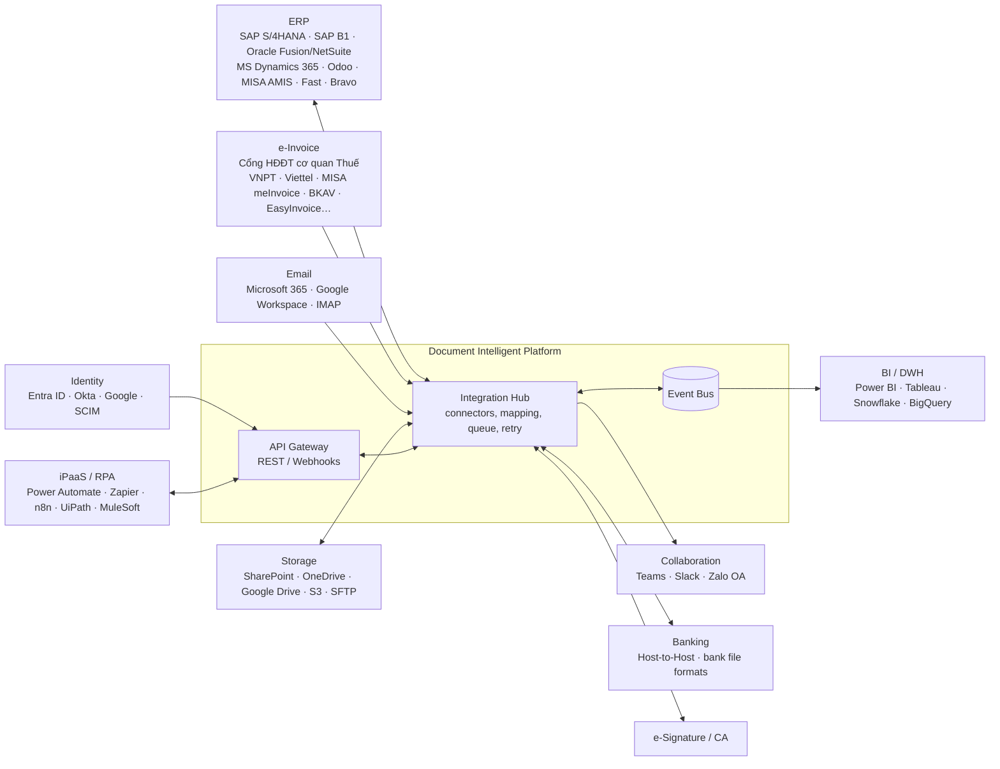

# 05. Integration Requirements

## 1. Integration Architecture



## 2. Integration Principles

| ID | Nguyên tắc |
|----|-----------|
| INT-P01 | **API-first**: mọi chức năng trên UI đều có API tương ứng (OpenAPI 3.x spec công khai). |
| INT-P02 | **Event-driven**: phát sự kiện nghiệp vụ (document.received, document.extracted, invoice.matched, invoice.approved, invoice.posted, invoice.paid, exception.raised…) qua webhooks/event bus. |
| INT-P03 | **Connector framework**: connector dựng sẵn cho hệ thống phổ biến + SDK/Generic connector (REST, SOAP, DB, file) để mở rộng; mapping field cấu hình bằng UI. |
| INT-P04 | **Idempotency & reliability**: idempotency key cho mọi API ghi; retry với exponential backoff; dead-letter queue; reprocess thủ công. |
| INT-P05 | **Loose coupling**: DI không phụ thuộc cứng vào một ERP; mô hình dữ liệu chuẩn (canonical model) + mapping theo từng ERP. |

## 3. ERP Integration

| ID | Luồng | Hướng | Tần suất | Ưu tiên |
|----|-------|-------|----------|---------|
| INT-ERP-001 | Vendor master (incl. bank accounts, payment terms, status) | ERP → DI | Near real-time / 15 phút | M |
| INT-ERP-002 | Purchase Orders (header, lines, status, changes) | ERP → DI | Near real-time / 15 phút | M |
| INT-ERP-003 | Goods Receipts / Service Entry Sheets | ERP → DI | Near real-time / 15 phút | M |
| INT-ERP-004 | GL accounts, cost centers, tax codes, projects, currencies, exchange rates, items, UoM | ERP → DI | Hằng ngày + on-demand | M |
| INT-ERP-005 | **Post invoice** (vendor invoice / AP document / parked invoice) kèm link/đính kèm ảnh chứng từ | DI → ERP | Real-time (event) | M |
| INT-ERP-006 | Post credit/debit note | DI → ERP | Real-time | M |
| INT-ERP-007 | Payment status / clearing / remittance | ERP → DI | Hằng ngày / event | S |
| INT-ERP-008 | Budget availability check | DI → ERP (query) | On-demand | C |
| INT-ERP-009 | Tạo/cập nhật vendor (sau onboarding), cập nhật PO price | DI → ERP | Event | C |
| INT-ERP-010 | Đồng bộ trạng thái hai chiều & reconciliation job (phát hiện chênh lệch DI ↔ ERP) | Both | Hằng ngày | S |

**Connector ưu tiên (xác nhận với khách hàng):**

| ERP | Phương thức gợi ý | Ưu tiên |
|-----|-------------------|---------|
| SAP S/4HANA / ECC | OData / BAPI / IDoc (qua SAP BTP hoặc RFC) | M |
| MS Dynamics 365 F&O / Business Central | OData / Dataverse API | S |
| Oracle Fusion / NetSuite | REST / SuiteTalk | S |
| Odoo | JSON-RPC / REST | S |
| MISA AMIS / Fast / Bravo (ERP/phần mềm kế toán VN) | Open API / file import / DB staging (tùy phiên bản) | M (tùy khách hàng) |
| Khác / in-house | Generic REST / DB staging / file (CSV, Excel, XML) | M |

## 4. e-Invoice & Tax Integration (Việt Nam)

| ID | Yêu cầu | Ưu tiên |
|----|---------|---------|
| INT-TAX-001 | Tra cứu **tình trạng hoạt động MST** người bán. | M |
| INT-TAX-002 | Tra cứu / xác thực **hóa đơn điện tử** trên cổng hóa đơn điện tử của cơ quan Thuế (tồn tại, mã CQT, trạng thái: hợp lệ / thay thế / điều chỉnh / hủy). Hỗ trợ tra cứu định kỳ lại trước thời điểm thanh toán và trước kỳ kê khai. | M |
| INT-TAX-003 | Đồng bộ danh sách hóa đơn đầu vào theo MST người mua (qua cổng Thuế hoặc T-VAN/nhà cung cấp dịch vụ HĐĐT được ủy quyền) để phát hiện hóa đơn **chưa nhận được file** từ vendor. | S |
| INT-TAX-004 | Parse XML hóa đơn theo định dạng chuẩn hiện hành; cập nhật parser khi quy định thay đổi (cấu hình version). | M |
| INT-TAX-005 | Xác thực chữ ký số (chứng thư số của người bán & của cơ quan Thuế nếu có mã). | M |
| INT-TAX-006 | Xuất dữ liệu phục vụ **kê khai thuế GTGT đầu vào** (bảng kê hóa đơn mua vào) theo mẫu cấu hình được. | C |
| INT-TAX-007 | Cơ chế **fallback** khi cổng tra cứu không khả dụng: queue & retry, cho phép xử lý tiếp với cờ "pending verification", chặn thanh toán đến khi verify xong (cấu hình). | M |

> Ghi chú: Phương thức kết nối cụ thể (API chính thức, T-VAN, nhà cung cấp dữ liệu trung gian, hoặc tự động hóa tra cứu) cần xác định trong giai đoạn Discovery dựa trên khả năng hiện hành của cơ quan Thuế và điều khoản sử dụng; tuân thủ quy định pháp luật về hóa đơn, chứng từ (Nghị định 123/2020/NĐ-CP và các văn bản sửa đổi, bổ sung như Nghị định 70/2025/NĐ-CP; Thông tư 78/2021/TT-BTC và văn bản hướng dẫn hiện hành).

## 5. Email & Document Sources

| ID | Yêu cầu | Ưu tiên |
|----|---------|---------|
| INT-SRC-001 | Microsoft 365 (Graph API, OAuth2, shared mailbox), Google Workspace (Gmail API), IMAP/POP3 (fallback). Không lưu mật khẩu dạng plain text. | M |
| INT-SRC-002 | SharePoint / OneDrive / Google Drive / Amazon S3 / SFTP folder watch; ghi ngược file đã xử lý & metadata (tùy chọn). | S |
| INT-SRC-003 | Nhận chứng từ từ RPA/iPaaS qua API. | S |

## 6. Collaboration & Notification

| ID | Yêu cầu | Ưu tiên |
|----|---------|---------|
| INT-COL-001 | Microsoft Teams app/bot: nhận thông báo, adaptive card approve/reject, hỏi AI assistant. | S |
| INT-COL-002 | Slack app: tương tự Teams. | C |
| INT-COL-003 | Zalo OA / SMS gateway cho thông báo vendor/approver (thị trường VN). | C |
| INT-COL-004 | SMTP / email service (SendGrid, SES, M365) cho email outbound, có DKIM/SPF. | M |

## 7. Banking & Payment

| ID | Yêu cầu | Ưu tiên |
|----|---------|---------|
| INT-BNK-001 | Xuất file thanh toán theo định dạng các ngân hàng phổ biến tại VN (Vietcombank, BIDV, Techcombank, VietinBank, MB, ACB…) và chuẩn ISO 20022 pain.001. | C |
| INT-BNK-002 | Host-to-Host / Open API ngân hàng để gửi lệnh & nhận trạng thái (qua ERP hoặc trực tiếp). | C |
| INT-BNK-003 | Xác minh tên chủ tài khoản (account name inquiry) khi ngân hàng hỗ trợ. | C |

## 8. Identity & Security Integration

| ID | Yêu cầu | Ưu tiên |
|----|---------|---------|
| INT-IAM-001 | SSO SAML 2.0 / OIDC (Entra ID, Okta, Google, Keycloak). | M |
| INT-IAM-002 | SCIM 2.0 provisioning / deprovisioning. | S |
| INT-IAM-003 | Đồng bộ org chart (manager, department, cost center) từ Entra ID / HRIS. | S |
| INT-IAM-004 | Tích hợp SIEM (Splunk, Sentinel, ELK) cho audit & security logs (syslog/HTTP). | S |
| INT-IAM-005 | Secrets lưu trong vault (HashiCorp Vault, AWS Secrets Manager, Azure Key Vault). | M |

## 9. Public API & Webhooks

| ID | Yêu cầu | Ưu tiên |
|----|---------|---------|
| INT-API-001 | REST API (JSON) có versioning (`/v1`), OpenAPI spec, sandbox environment, API docs portal. | M |
| INT-API-002 | Xác thực OAuth 2.0 client credentials + API key có scope; rate limiting theo tenant/client. | M |
| INT-API-003 | Endpoints tối thiểu: documents (upload, get, list, search, download), extraction results, validation results, matching, workflow tasks (list, action), vendors, POs, GRNs, invoices, webhooks subscription, audit logs. | M |
| INT-API-004 | Webhooks có ký HMAC, retry, delivery log, replay. | M |
| INT-API-005 | Async processing: upload trả `document_id` ngay, kết quả qua webhook hoặc polling. | M |
| INT-API-006 | SDK (Python, JavaScript/TypeScript, .NET, Java). | C |
| INT-API-007 | Connector cho iPaaS (Power Automate custom connector, Zapier, n8n node). | C |
| INT-API-008 | **MCP server** để AI agent bên ngoài (ví dụ Claude, Copilot) truy vấn và thao tác có kiểm soát trên dữ liệu DI theo quyền của người dùng. | C |

### 9.1 Ví dụ webhook payload

```json
{
  "event": "invoice.matched",
  "event_id": "evt_01J9Z6X...",
  "occurred_at": "2026-09-26T08:15:30Z",
  "tenant_id": "tn_abc",
  "data": {
    "document_id": "doc_01J9Z5...",
    "document_type": "INVOICE",
    "vendor": { "id": "V000123", "tax_id": "0101234567", "name": "Công ty TNHH ABC" },
    "invoice_number": "0001234",
    "invoice_series": "1C26TAA",
    "invoice_date": "2026-09-20",
    "currency": "VND",
    "total_amount": 110000000,
    "match_status": "MATCHED_WITHIN_TOLERANCE",
    "po_numbers": ["4500012345"],
    "exceptions": []
  }
}
```

## 10. Integration Monitoring

| ID | Yêu cầu | Ưu tiên |
|----|---------|---------|
| INT-MON-001 | Dashboard trạng thái tích hợp: số message thành công/lỗi, độ trễ, lần sync cuối theo connector. | M |
| INT-MON-002 | Cảnh báo khi connector lỗi liên tục / không sync quá N phút. | M |
| INT-MON-003 | Xem payload request/response (đã mask dữ liệu nhạy cảm) và reprocess từ UI. | M |
