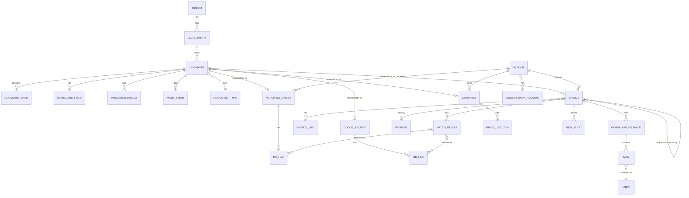
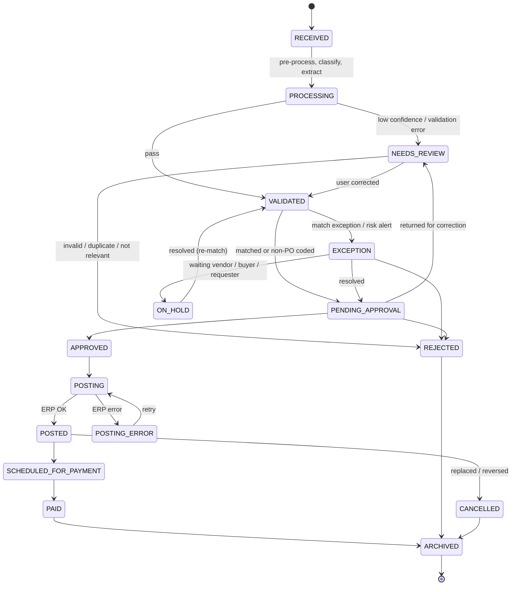

# 07. Data Model

## 1. Conceptual Entity Model

## 2. Key Entities & Fields

### 2.1 Document (generic)

| Field | Type | Mô tả |
|-------|------|-------|
| document_id | ULID | Khóa chính |
| tenant_id, legal_entity_id | ID | Phân vùng dữ liệu |
| document_type | Enum | INVOICE, PO, GRN, CREDIT_NOTE, DEBIT_NOTE, CONTRACT, QUOTATION, STATEMENT, RECEIPT, OTHER, custom |
| source_channel | Enum | EMAIL, UPLOAD, MOBILE, API, SFTP, PORTAL, EINVOICE_SYNC, SCANNER |
| source_ref | String | Message-ID email, API client, đường dẫn file… |
| sender | String | Email/Portal user |
| received_at | Timestamp | |
| file_hash | String | SHA-256 file gốc |
| original_file_uri, rendition_uri | URI | File gốc (immutable) & PDF/A |
| language | String | vi, en, … |
| page_count | Int | |
| classification_confidence | Decimal | |
| status | Enum | Xem mục 3 |
| package_id | ID | Gói chứng từ liên quan |
| retention_until, legal_hold | Date, Bool | |
| created_by, updated_at, version | | |

### 2.2 Invoice

| Field | Type | Bắt buộc | Ghi chú |
|-------|------|----------|---------|
| invoice_form (mẫu số) | String | VN e-invoice | Ví dụ `1` (HĐ GTGT) |
| invoice_series (ký hiệu) | String | VN e-invoice | Ví dụ `1C26TAA` |
| invoice_number | String | ✔ | |
| invoice_date | Date | ✔ | |
| tax_authority_code (mã CQT) | String | nếu có mã | |
| invoice_kind | Enum | ✔ | STANDARD, ADJUSTMENT, REPLACEMENT, CREDIT_NOTE, DEBIT_NOTE, PREPAYMENT, RECURRING |
| original_invoice_ref | Ref | nếu điều chỉnh/thay thế | |
| vendor_id / seller_name / seller_tax_id / seller_address | | ✔ | |
| buyer_name / buyer_tax_id / buyer_address | | ✔ | Validate với legal entity |
| po_numbers | String[] | PO invoice | |
| contract_ref | String | | |
| currency, exchange_rate | | ✔ | |
| subtotal, discount_amount, tax_amount, total_amount | Decimal | ✔ | Theo từng thuế suất |
| tax_breakdown | Array | ✔ | {rate: 0/5/8/10/KCT/KKKNT, taxable_amount, tax_amount} |
| amount_in_words | String | | Cross-check với total |
| payment_terms, due_date | | | |
| payment_method | String | | TM/CK |
| bank_account_no, bank_name, beneficiary | | | Kiểm tra fraud |
| gl_coding | Array | Non-PO | {gl_account, cost_center, project, tax_code, amount} |
| einvoice_verification | Object | VN e-invoice | {xml_valid, signature_valid, cert_info, tax_portal_status, checked_at, evidence_uri} |
| match_status, exceptions | Enum, Array | | |
| risk_score, risk_alerts | | | |
| erp_document_no, posted_at | | | Sau khi post |
| payment_status, paid_at, payment_ref | | | |

### 2.3 Invoice Line

| Field | Type | Ghi chú |
|-------|------|---------|
| line_no | Int | |
| item_code_vendor, item_code_internal | String | Mapping bằng AI/lịch sử |
| description | String | |
| uom | String | Chuẩn hóa |
| quantity, unit_price, discount, amount | Decimal | |
| tax_rate, tax_amount | | |
| po_line_ref, gr_line_ref | Ref | Kết quả matching |
| category, gl_account, cost_center | | Gợi ý bởi AI |

### 2.4 Purchase Order / PO Line

`po_number, legal_entity, vendor_id, buyer, order_date, currency, payment_terms, incoterms, status, total_amount, lines[] {line_no, item_code, description, uom, qty_ordered, unit_price, tax_code, delivery_date, qty_received, qty_invoiced, amount_invoiced, is_service, closed_flag}`

### 2.5 Goods Receipt / GR Line

`gr_number, po_number, receipt_date, received_by, warehouse/location, lines[] {po_line_ref, qty_received, qty_rejected, uom}`

### 2.6 Vendor

`vendor_id (ERP), name, tax_id, country, address, status (ACTIVE/BLOCKED/INACTIVE), tax_status (từ cơ quan Thuế), payment_terms, currency, bank_accounts[] {account_no, bank, branch, beneficiary, verified_by, verified_at, effective_from, status}, contacts[], email_domains[], risk_rating, strategic_flag, automation_level (L0–L3)`

### 2.7 Contract

`contract_no, vendor_id, title, start_date, end_date, auto_renewal, notice_period_days, total_value, consumed_value, currency, payment_terms, price_list[] {item, uom, unit_price, valid_from, valid_to}, key_clauses[] {type, text, page_ref}, owner`

### 2.8 Extracted Field (generic, cho mọi document)

`document_id, field_path (ví dụ lines[3].unit_price), raw_value, normalized_value, confidence, source (XML/OCR/LLM/DERIVED/USER), page, bbox, model_version, corrected_by, corrected_at, previous_value`

### 2.9 Workflow Instance / Task

`workflow_instance_id, workflow_definition_id, version, document_id, current_step, status, started_at, ended_at; task {task_id, type, assignee (user/group), delegated_from, due_at, sla_status, action, comment, acted_at}`

### 2.10 Audit Event

`event_id, tenant_id, actor (user/system/api_client/ai_agent), action, object_type, object_id, before, after, ip, user_agent, timestamp, hash_chain` (append-only)

## 3. Document Lifecycle

## 4. Data Retention & Classification

| Dữ liệu | Phân loại | Retention mặc định |
|---------|-----------|--------------------|
| File chứng từ gốc, XML HĐĐT, dữ liệu trích xuất đã xác nhận | Confidential – Financial | ≥ 10 năm (cấu hình) |
| Audit log nghiệp vụ | Confidential | ≥ 10 năm |
| Access log hệ thống | Internal | ≥ 1 năm |
| AI prompts/outputs log | Confidential | 90 ngày – 1 năm (cấu hình, có masking) |
| Email body không phải chứng từ (spam/irrelevant) | Internal | 90 ngày |
| Dữ liệu cá nhân (liên hệ vendor, user) | Personal data | Theo mục đích xử lý; hỗ trợ yêu cầu xóa/ẩn danh khi không vi phạm nghĩa vụ lưu trữ kế toán |
