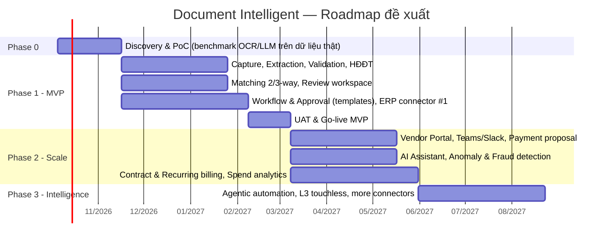

# 09. Roadmap, Risks & Open Questions

## 1. Release Roadmap (đề xuất)

| Phase | Mục tiêu | Phạm vi chính | Exit criteria |
|-------|----------|---------------|---------------|
| **0. Discovery & PoC** (≈ 6 tuần) | Xác nhận khả thi & chọn công nghệ | Thu thập ≥ 1.000 chứng từ mẫu (đã ẩn danh nếu cần), benchmark 2–3 OCR/LLM stack, xác nhận ERP & phương thức kết nối cổng Thuế, chốt quy trình To-Be, approval matrix | Báo cáo benchmark, kiến trúc được duyệt, backlog MVP được chốt |
| **1. MVP** (≈ 4–5 tháng) | Tự động hóa invoice AP cốt lõi | ING (email, upload, API, XML), PRE, CLS, EXT (invoice, PO, GRN, credit note), VAL (incl. HĐĐT, duplicate, bank account), MAT 2/3-way, REV, WF templates + approval matrix + SLA, ERP connector chính (2 chiều), REP, RPT operational, ADM (SSO, RBAC, audit) | Accuracy đạt target MVP; STP ≥ 40%; UAT sign-off; pentest pass |
| **2. Scale** (≈ 3 tháng) | Mở rộng người dùng & giá trị | Vendor Portal, mobile approval, Teams/Slack, payment proposal, AI assistant, anomaly/fraud detection, contract & recurring billing, spend analytics, SFTP/SharePoint, thêm document types | STP ≥ 60%; cycle time ≤ 3 ngày; ≥ 30% invoice qua Portal/XML |
| **3. Intelligence** (≈ 3 tháng) | Touchless & agentic | Automation L3, agentic exception handling, quotation comparison, 4-way matching, banking integration, MCP server, connector marketplace | STP ≥ 70%; cycle time ≤ 2 ngày; chi phí/invoice −60% |

## 2. MVP Scope Summary (Must-have)

- **Documents:** Invoice (XML + PDF/scan), PO, GRN, Credit/Debit note.
- **Channels:** Email, Web upload, REST API, HĐĐT XML.
- **AI/OCR:** Tiếng Việt + English, header + line items, confidence + grounding, HITL.
- **Validation:** Math, mandatory, vendor, MST, HĐĐT (XML/signature/tax portal), duplicate, bank account, custom rules.
- **Matching:** 2-way, 3-way, tolerance, line-level AI matching, credit note linking.
- **Workflow:** Designer + templates, approval matrix, delegation, SLA/escalation, SoD.
- **Integration:** 1 ERP (2 chiều), M365/Gmail, SSO, webhooks, public API.
- **Repository & Reporting:** Search, retention, audit log, operational & automation dashboards.

## 3. Assumptions

| # | Giả định |
|---|---------|
| A1 | Khách hàng cung cấp ≥ 1.000 chứng từ thực tế đại diện (đa vendor, đa layout) cho PoC và làm golden dataset. |
| A2 | ERP có API hoặc cơ chế tích hợp khả dụng; khách hàng cung cấp môi trường sandbox ERP và đầu mối kỹ thuật. |
| A3 | Master data (vendor, PO, GRN) trên ERP đủ chất lượng để matching; nếu không, cần giai đoạn data cleansing. |
| A4 | Khách hàng chấp thuận sử dụng dịch vụ OCR/LLM trên cloud với cam kết bảo mật phù hợp, hoặc cung cấp hạ tầng GPU cho self-hosted. |
| A5 | Business owner có thẩm quyền chốt quy trình To-Be, approval matrix và tolerance. |
| A6 | Người dùng có tài khoản trên IdP của doanh nghiệp (Entra ID/Google) cho SSO. |

## 4. Constraints

- Ngân sách & timeline MVP cố định (cần xác nhận).
- Dữ liệu tài chính có thể không được phép ra khỏi Việt Nam / ra khỏi hạ tầng khách hàng → ảnh hưởng lựa chọn OCR/LLM.
- Khả năng và giới hạn của cổng tra cứu hóa đơn điện tử (rate limit, captcha, thay đổi giao diện/API) nằm ngoài kiểm soát của dự án.

## 5. Risks & Mitigation

| # | Rủi ro | Xác suất | Tác động | Giảm thiểu |
|---|--------|----------|----------|------------|
| R1 | Accuracy không đạt target do chứng từ scan kém, chữ viết tay, layout đa dạng | M | H | PoC trên dữ liệu thật; hybrid OCR+LLM; vendor memory; HITL; khuyến khích vendor gửi XML/Portal |
| R2 | Master data PO/GRN không đầy đủ → matching exception cao | H | H | Data quality assessment ở Phase 0; quy trình bắt buộc GRN; AI suy luận PO; báo cáo nguyên nhân exception |
| R3 | Tích hợp ERP phức tạp/chậm (custom ERP, thiếu API) | M | H | Chọn phương thức sớm; staging DB/file fallback; connector framework; sandbox sớm |
| R4 | Cổng Thuế thay đổi/không ổn định | M | M | Lớp adapter cô lập, provider trung gian dự phòng, queue & retry, cờ pending verification |
| R5 | Chi phí AI (LLM/OCR) vượt dự kiến khi volume tăng | M | M | Structured-first (XML), model routing, caching, quota theo tenant, theo dõi cost/page |
| R6 | Rủi ro bảo mật: rò rỉ dữ liệu tài chính, prompt injection, gian lận bank account | L | H | Mã hóa, least privilege, AI không có quyền hành động tài chính, 4-eyes bank change, pentest, SIEM |
| R7 | Người dùng không tin kết quả AI, tiếp tục làm thủ công | M | M | Grounding/highlight nguồn, explainable alerts, automation level tăng dần (L0→L3), đào tạo & change management |
| R8 | Thay đổi quy định pháp luật về hóa đơn/thuế/dữ liệu cá nhân | M | M | Rule & parser cấu hình được; theo dõi quy định; tư vấn pháp lý của khách hàng xác nhận |
| R9 | Scope creep (sourcing, inventory, payment execution) | M | M | Scope baseline rõ ràng, change request process |

## 6. Open Questions (cần làm rõ với khách hàng)

| # | Câu hỏi | Owner |
|---|---------|-------|
| Q1 | ERP/phần mềm kế toán hiện tại là gì (SAP, D365, Oracle, Odoo, MISA, Fast, Bravo, in-house)? Phiên bản? Có sẵn API? | IT |
| Q2 | Volume hiện tại & dự kiến: số invoice/tháng, số trang trung bình, tỷ lệ HĐĐT XML vs. giấy/scan vs. hóa đơn nước ngoài? | AP Manager |
| Q3 | Số legal entities, currencies, ngôn ngữ chứng từ? | Finance |
| Q4 | Tỷ lệ invoice có PO vs. non-PO? GRN có được ghi nhận nhất quán trên ERP không? | Procurement |
| Q5 | Approval matrix & tolerance hiện hành? Có delegation of authority (DoA) chính thức? | Finance / Procurement |
| Q6 | Yêu cầu triển khai: SaaS, dedicated cloud hay on-premise? Data residency (VN bắt buộc?) | IT / Legal |
| Q7 | Chính sách sử dụng AI/LLM trên cloud: được phép? Provider nào đã được phê duyệt? | IT Security / Legal |
| Q8 | IdP hiện tại (Entra ID, Google, Okta)? Công cụ collaboration (Teams, Slack, Zalo)? | IT |
| Q9 | Có nhu cầu Vendor Portal ở MVP? Số lượng vendor active? | Procurement |
| Q10 | Có yêu cầu tạo payment file/tích hợp ngân hàng trực tiếp không, hay qua ERP? | Treasury |
| Q11 | Yêu cầu báo cáo/BI hiện có (Power BI, Tableau…)? KPI nào đang được đo? | Finance |
| Q12 | Yêu cầu tuân thủ đặc thù ngành (ngân hàng, bảo hiểm, niêm yết, SOX…)? | Compliance |
| Q13 | Chứng từ lịch sử cần migrate vào repository (số lượng, định dạng, thời gian)? | AP / IT |
| Q14 | Mô hình licensing mong muốn: theo user, theo số trang/chứng từ, hay theo entity? | Business |

## 7. Next Steps

1. Review & feedback tài liệu yêu cầu với Stakeholders (Procurement, AP, Finance, IT) — 1 tuần.
2. Workshop làm rõ Open Questions & chốt quy trình To-Be.
3. Thu thập bộ chứng từ mẫu và khởi động PoC (Phase 0).
4. Lập WBS & ước lượng effort/chi phí chi tiết dựa trên scope MVP đã chốt.
5. Chốt kiến trúc giải pháp & tech stack sau PoC.
