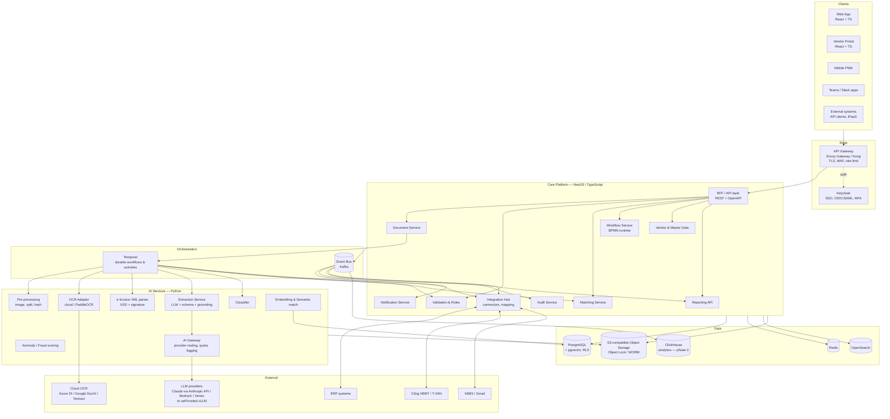
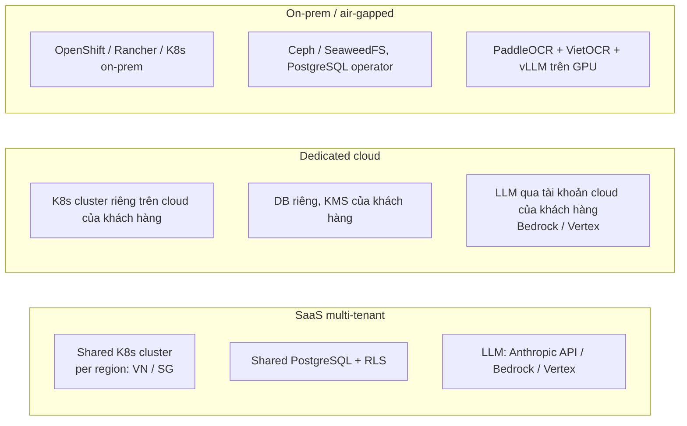

# 10. Solution Architecture & Technology Stack

> Trạng thái: **Draft v0.1 — đang trao đổi để xác nhận** · Ngày: 2026-09-26
> Các quyết định đánh dấu ✅ đã được xác nhận; 🟡 là đề xuất, cần xác nhận (xem [mục 12](#12-decision-log-adr)).

## 1. Architecture Drivers

| Driver | Nguồn | Ảnh hưởng đến kiến trúc |
|--------|-------|-------------------------|
| Cloud-agnostic, chạy được SaaS / dedicated / on-prem | ✅ Quyết định | Kubernetes, chỉ dùng component open-source hoặc có adapter; không phụ thuộc dịch vụ managed độc quyền |
| Hybrid AI: OCR/LLM cloud, có thể chuyển self-hosted | ✅ Quyết định | Lớp **AI Gateway** trừu tượng provider; pipeline structured-first |
| NestJS (TypeScript) + Python AI | ✅ Quyết định | Hai runtime; hợp đồng giao tiếp rõ ràng (gRPC/REST + event) |
| Workflow designer dựa trên **bpmn-js** | ✅ Quyết định | Chuẩn BPMN 2.0; cần execution engine phía sau (bpmn-js chỉ là modeler/viewer) |
| Dữ liệu tài chính, lưu 10 năm, audit bất biến | NFR-CMP | WORM storage, audit log hash-chain, retention policy |
| 100k chứng từ/tháng/tenant, burst cuối tháng | NFR-SCL | Xử lý bất đồng bộ qua queue, autoscale worker theo queue depth |
| Accuracy & HITL | AI-P0x | Grounding (bbox), confidence, feedback loop, golden dataset |
| Tích hợp ERP đa dạng | INT-P0x | Integration Hub + canonical model + connector SDK |

## 2. High-level Architecture



### 2.1 Nguyên tắc kiến trúc

1. **Modular monolith cho core ở MVP, tách service khi cần** ✅ — các module NestJS (document, validation, matching, workflow, vendor, integration…) tách ranh giới rõ (bounded context, schema DB riêng, giao tiếp qua interface/event) trong **một deployable**; AI workers (Python) và Integration Hub là deployable riêng vì cần scale độc lập. Giảm chi phí vận hành giai đoạn đầu, vẫn tách được thành microservices sau.
2. **Durable orchestration**: mọi xử lý nhiều bước (pipeline chứng từ, approval, retry tích hợp ERP) chạy trên **Temporal** → không mất trạng thái khi pod restart, retry/timeout khai báo.
3. **Event-driven ra ngoài**: thay đổi nghiệp vụ phát event qua **transactional outbox** → Kafka → webhooks, notification, audit, analytics.
4. **Structured-first AI**: HĐĐT XML và dữ liệu ERP đi thẳng, không qua LLM; OCR/LLM chỉ cho chứng từ không có cấu trúc.
5. **Provider-agnostic**: OCR, LLM, object storage, IdP, ERP đều qua adapter.
6. **Security by design**: tenant isolation tại DB (RLS), mã hóa envelope theo tenant, AI không có quyền thực thi hành động tài chính.

## 3. Document Processing Pipeline (runtime view)

```mermaid
sequenceDiagram
    autonumber
    participant SRC as Email/Upload/API
    participant DOC as Document Service
    participant OBJ as Object Storage
    participant T as Temporal
    participant PRE as Pre-process (Py)
    participant XML as XML Parser (Py)
    participant OCR as OCR Adapter (Py)
    participant EX as Extraction (Py)
    participant AI as AI Gateway
    participant VAL as Validation
    participant MAT as Matching
    participant WF as Workflow (BPMN)
    SRC->>DOC: file + metadata
    DOC->>OBJ: lưu file gốc (immutable, SHA-256)
    DOC->>T: start DocumentPipeline(docId)
    T->>PRE: malware scan, detect type, split, dedupe, enhance
    alt e-Invoice XML
        T->>XML: parse + XSD + verify signature
    else PDF/scan/image
        T->>OCR: text + layout + tables + bbox
        T->>EX: classify + extract (schema)
        EX->>AI: LLM call (page images + OCR text + JSON schema)
        AI-->>EX: structured JSON
        EX->>EX: grounding: map value → bbox; confidence
    end
    T->>VAL: rules, MST, tax portal, duplicate, bank account
    T->>MAT: 2/3-way match
    alt low confidence / exception
        T->>WF: human task (review/exception)
        WF-->>T: completed (corrected data)
    end
    T->>WF: start Approval process (BPMN)
    WF-->>T: approved
    T->>DOC: post ERP (Integration Hub activity, idempotent)
```

## 4. Workflow Engine — bpmn-js + execution runtime

**bpmn-js** (bộ công cụ bpmn.io) là thư viện **modeler/viewer** BPMN 2.0 chạy trên trình duyệt — không thực thi quy trình. Cần kết hợp:

| Thành phần | Đề xuất | Vai trò |
|-----------|---------|---------|
| Process designer | **bpmn-js** ✅ + properties panel tùy biến | Business Admin thiết kế quy trình kéo thả; chỉ hiển thị các element được hỗ trợ; palette custom (Approval task, AI step, ERP post, Notify…) |
| Decision tables | **dmn-js** 🟡 | Approval matrix, tolerance, routing rules dạng bảng quyết định |
| Task forms | **form-js** 🟡 | Form cho human task (cấu hình field hiển thị/bắt buộc) |
| Expression language | **FEEL** (thư viện `feelin`) 🟡 | Điều kiện trên gateway / decision table, cùng chuẩn với DMN |
| Execution runtime | ✅ **Phương án A: BPMN interpreter trên Temporal (TypeScript SDK)** | Workflow Service đọc BPMN XML đã publish, thực thi một **tập con BPMN** được hỗ trợ bằng Temporal workflow generic |

### 4.1 So sánh phương án execution runtime

| Tiêu chí | **A. BPMN subset trên Temporal (TS)** | B. `bpmn-engine` (npm) + tự persist | C. Flowable OSS / Camunda 8 |
|---------|----------------------------------|-------------------------------------|-----------------------------|
| Stack | TypeScript thuần, dùng chung Temporal với pipeline | TypeScript | Thêm runtime JVM |
| Độ bền (durable, retry, timer dài ngày) | Rất tốt (Temporal) | Tự xây — rủi ro | Rất tốt |
| Độ phủ BPMN | Tập con (đủ cho P2P) | Khá rộng | Đầy đủ |
| Effort | Trung bình (interpreter + test) | Trung bình–cao (persistence, scale) | Thấp cho engine, trung bình cho tích hợp |
| Versioning quy trình đang chạy | Temporal worker versioning + BPMN version lưu trong DB | Tự xây | Có sẵn |
| License | MIT (Temporal), bpmn.io license | MIT | Flowable: Apache 2.0; Camunda 8 self-managed production cần license thương mại — cần kiểm tra |
| Rủi ro chính | Phải kiểm soát chặt tập element hỗ trợ | Độ trưởng thành, scale | Thêm công nghệ, dữ liệu quy trình nằm ngoài core |

**Đã chốt: Phương án A.** Temporal đã cần cho pipeline xử lý chứng từ, nên dùng chung một engine cho cả approval workflow → một stack, một cách vận hành, một cơ chế retry/timer. Phương án C (Flowable) giữ làm dự phòng nếu khách hàng yêu cầu độ phủ BPMN đầy đủ.

### 4.2 Tập con BPMN hỗ trợ (MVP)

| Element | Mapping trên runtime |
|---------|---------------------|
| Start / End event (none, message) | Temporal workflow start / completion; message start = trigger từ event |
| User Task (approval, review, exception) | Tạo task trong DB + chờ Temporal signal (approve/reject/return) |
| Service Task (custom types: `erp.post`, `ai.classify`, `notify.send`, `http.call`…) | Temporal activity theo registry, retry policy cấu hình |
| Business Rule Task | Đánh giá DMN (dmn-js model + FEEL evaluator) |
| Exclusive / Parallel / Inclusive Gateway | Rẽ nhánh, chạy song song (`Promise.all`), điều kiện FEEL |
| Timer (intermediate, boundary) | Temporal timer — SLA reminder, escalation, cooling-off |
| Boundary error / escalation | Nhánh xử lý lỗi, escalation |
| Call Activity (sub-process) | Child workflow |
| Multi-instance user task (parallel approval N-of-M) | Vòng lặp child task + điều kiện hoàn thành |

Element ngoài danh sách bị **ẩn khỏi palette** và bị **lint chặn khi publish** (dùng `bpmnlint` với rule tùy chỉnh).

> **License bpmn.io:** được dùng miễn phí kể cả thương mại, nhưng phải giữ nguyên watermark/logo bpmn.io hiển thị trên canvas. Cần xác nhận với khách hàng là chấp nhận được, hoặc liên hệ bpmn.io nếu cần gỡ.

## 5. AI / OCR Architecture (Hybrid)

### 5.1 Thành phần

| Thành phần | Công nghệ đề xuất | Ghi chú |
|-----------|-------------------|---------|
| Runtime | Python 3.12, FastAPI (API nội bộ), Temporal Python SDK (activity worker) | Workers scale theo queue |
| PDF & image | `pypdfium2` (render), `pdfplumber` (text layer), OpenCV, Pillow | **Tránh PyMuPDF** (AGPL) trừ khi mua license thương mại |
| OCR — cloud | Adapter cho Azure AI Document Intelligence / Google Document AI / AWS Textract (chọn sau benchmark) | Trả text + bbox + table |
| OCR — self-hosted | PaddleOCR (detection + layout/table) + VietOCR (nhận dạng tiếng Việt) trên GPU | Cho on-prem / air-gapped |
| e-Invoice | `lxml` + XSD validation; `signxml`/`cryptography` kiểm tra chữ ký số và chuỗi chứng thư | Không qua LLM |
| LLM extraction | **Claude** qua AI Gateway; structured outputs theo JSON schema của document type | Chi tiết 5.2 |
| LLM self-hosted (tùy chọn) | Open-weight vision-language model qua **vLLM** trên GPU | Cho khách hàng không cho dữ liệu ra ngoài |
| Embedding | Model embedding đa ngôn ngữ (có tiếng Việt), lưu `pgvector` | Semantic item matching, search |
| Anomaly | scikit-learn / PyOD + rule engine | Risk score có giải thích |
| Evaluation | Golden dataset + eval harness (pytest) chạy trong CI | Quality gate trước khi đổi model/prompt |

### 5.2 LLM strategy (Claude)

| Hạng mục | Đề xuất |
|---------|---------|
| Model mặc định | **Claude Opus 5** (`claude-opus-5`) cho extraction & AI assistant — độ chính xác cao nhất với chứng từ phức tạp, bảng nhiều trang, đa ngôn ngữ. |
| Model routing (tùy chọn, 🟡 quyết định sau PoC) | Đo trên golden dataset: nếu **Claude Sonnet 5** / **Claude Haiku 4.5** (hoặc Opus 5 với `effort` thấp) đạt cùng accuracy cho chứng từ đơn giản (invoice 1–2 trang, layout đã biết), route loại đó sang cấu hình rẻ hơn. Chỉ áp dụng khi số liệu chứng minh không giảm chất lượng. |
| Structured outputs | `output_config.format` với JSON schema của từng document type → output luôn hợp lệ schema, không cần parse text. |
| Grounding | Gửi kèm ảnh trang + OCR text có ID theo từng dòng/ô; yêu cầu model trả về ID nguồn cho mỗi field → map về bbox. (Citations API không dùng chung được với structured outputs, nên grounding làm theo cách này.) |
| Chi phí | **Prompt caching** cho phần cố định (system prompt, schema, few-shot của vendor); **Message Batches API** (−50% chi phí) cho xử lý không gấp (backlog, re-process, migrate chứng từ lịch sử). |
| Kênh truy cập | **Anthropic API** (mặc định); **Amazon Bedrock** hoặc **Google Vertex AI** khi khách hàng đã có hợp đồng cloud đó hoặc cần region cụ thể. AI Gateway dùng SDK chính thức của từng kênh. |
| Data residency | Chọn region/`inference_geo` phù hợp; hồ sơ chuyển dữ liệu ra nước ngoài theo quy định bảo vệ dữ liệu cá nhân; masking trường không cần thiết trước khi gửi. |
| An toàn | Nội dung chứng từ luôn là **dữ liệu** trong prompt; AI chỉ trả dữ liệu/gợi ý; mọi hành động tài chính qua người dùng + workflow. Xử lý `stop_reason` (refusal, max_tokens) và fallback sang HITL. |

### 5.3 Ước tính chi phí AI (sơ bộ — cần xác nhận ở PoC)

Giả định invoice PDF/scan 2 trang ≈ 6.000 input tokens (ảnh + OCR text + schema) và 1.500 output tokens:

| Cấu hình | Chi phí/chứng từ (ước tính) | 100k chứng từ/tháng, 40% cần LLM (60% là XML) |
|---------|------------------------------|-----------------------------------------------|
| Opus 5 ($5 / $25 per 1M tokens) | ≈ $0,07 | ≈ $2.800/tháng |
| Opus 5 + caching phần cố định + batch cho backlog | ≈ $0,04–0,05 | ≈ $1.600–2.000/tháng |
| Sonnet 5 ($2 / $10), nếu PoC chứng minh đủ chính xác | ≈ $0,03 | ≈ $1.100/tháng |

Chưa gồm chi phí OCR cloud (thường tính theo trang) và giá qua Bedrock/Vertex (bảng giá riêng). Con số thực tế phụ thuộc số trang, độ phân giải ảnh và tỷ lệ HĐĐT XML của khách hàng.

## 6. Technology Stack (tổng hợp)

| Layer | Công nghệ đề xuất | License | Trạng thái |
|-------|-------------------|---------|-----------|
| **Frontend (Web, Portal)** | React 18+, TypeScript, Vite, TanStack Query/Router, Ant Design (bảng dữ liệu, form enterprise), i18next | MIT | 🟡 |
| Document viewer | PDF.js + overlay canvas hiển thị bbox | Apache 2.0 | 🟡 |
| Designer | bpmn-js, dmn-js, form-js | bpmn.io license | ✅ bpmn-js / 🟡 còn lại |
| Charts | Apache ECharts | Apache 2.0 | 🟡 |
| Mobile | PWA (MVP); React Native nếu cần app store (phase 2) | MIT | 🟡 |
| **Backend core** | Node.js 22 LTS, **NestJS**, TypeScript | MIT | ✅ |
| ORM / DB access | Prisma hoặc MikroORM (cần hỗ trợ RLS qua `SET app.tenant_id`) | Apache 2.0 / MIT | 🟡 |
| Validation / API contract | Zod / class-validator, OpenAPI 3.1 (sinh từ NestJS), gRPC hoặc REST nội bộ với AI services | MIT | 🟡 |
| Authorization | Keycloak (authN) + Cerbos hoặc OpenFGA (ABAC/ReBAC cho data-level permission) | Apache 2.0 | 🟡 |
| **AI services** | Python 3.12, FastAPI, Temporal Python SDK, Pydantic | MIT | ✅ |
| **Orchestration** | Temporal (self-hosted trên K8s, hoặc Temporal Cloud) | MIT | ✅ |
| **Event bus** | Apache Kafka (Strimzi operator hoặc managed Kafka của cloud) + transactional outbox; Debezium CDC cho analytics | Apache 2.0 | ✅ |
| **Database** | PostgreSQL 16+ (CloudNativePG operator), `pgvector`, Row-Level Security | PostgreSQL | 🟡 |
| Cache / lock / rate limit | Redis 7 hoặc Valkey | BSD | 🟡 |
| Search | OpenSearch (ICU tokenizer + asciifolding cho tiếng Việt có/không dấu) | Apache 2.0 | 🟡 |
| Object storage | S3 API: dịch vụ cloud (S3/GCS/Azure Blob qua adapter) hoặc Ceph RGW / SeaweedFS on-prem; **Object Lock** cho WORM | Apache 2.0 / LGPL | 🟡 (MinIO là AGPL — cân nhắc license) |
| Analytics | PostgreSQL read replica (MVP) → ClickHouse (phase 2); BI export sang Power BI/Tableau | Apache 2.0 | 🟡 |
| **Identity** | Keycloak (SSO broker SAML/OIDC, MFA, Organizations cho multi-tenant, SCIM qua extension) | Apache 2.0 | 🟡 |
| Secrets | OpenBao hoặc HashiCorp Vault + External Secrets Operator; KMS cloud khi có | MPL 2.0 / BSL | 🟡 |
| Malware scan | ClamAV (container riêng) | GPL (dùng như service riêng) | 🟡 |
| **Platform** | Kubernetes (EKS/AKS/GKE/OpenShift/Rancher), Helm, Argo CD (GitOps), KEDA (autoscale theo queue), cert-manager | Apache 2.0 | ✅ K8s |
| Ingress / API gateway | Gateway API với Envoy Gateway (hoặc Kong OSS) | Apache 2.0 | 🟡 |
| IaC | OpenTofu / Terraform | MPL / BSL | 🟡 |
| GPU (self-hosted AI) | NVIDIA GPU Operator, vLLM, Triton (tùy chọn) | Apache 2.0 | 🟡 |
| **Observability** | OpenTelemetry, Prometheus, Grafana, Loki, Tempo; Sentry (frontend errors) | Apache 2.0 / AGPL (Grafana stack, dùng nội bộ) | 🟡 |
| Security tooling | Trivy, Kyverno (policy), Falco (runtime), OWASP ZAP (DAST), Semgrep (SAST), Renovate | Apache 2.0 | 🟡 |
| **CI/CD** | GitHub Actions → container registry (Harbor on-prem) → Argo CD | — | 🟡 |
| Monorepo | Nx hoặc Turborepo (TS) + `uv` (Python) | MIT | 🟡 |
| Testing | Vitest/Jest, Playwright (E2E), Pact (contract), k6 (load), pytest + eval harness (AI) | MIT | 🟡 |

## 7. Data Architecture

| Hạng mục | Thiết kế |
|---------|---------|
| Multi-tenancy | ✅ **Shared DB + `tenant_id` + PostgreSQL RLS** (SaaS — mô hình go-live đầu tiên); **schema/DB riêng** hoặc **cluster riêng** cho gói Enterprise/on-prem — cùng codebase, chọn qua cấu hình. |
| Phân vùng dữ liệu | Partition bảng lớn (documents, extracted_fields, audit_events) theo tháng; archive partition cũ sang cold storage. |
| Encryption | TLS nội bộ (mTLS qua service mesh — tùy chọn); at-rest bởi storage/DB; **envelope encryption theo tenant** cho file chứng từ (data key per tenant, bọc bởi KMS/OpenBao) → hỗ trợ BYOK. |
| File lifecycle | `raw/` (immutable, Object Lock theo retention) → `rendition/` (PDF/A searchable) → `derived/` (ảnh trang, thumbnail); hot → warm → cold theo tuổi. |
| Audit | Bảng append-only + hash chain (mỗi bản ghi chứa hash bản trước); xuất định kỳ sang WORM storage. |
| Search index | OpenSearch index theo tenant (hoặc alias + filter); đồng bộ qua event, rebuild được từ PostgreSQL. |
| Master data | Vendor/PO/GRN đồng bộ từ ERP vào schema `masterdata` (read model), ERP là nguồn gốc (system of record). |
| Feedback / training data | Bảng hiệu chỉnh field + snapshot chứng từ, gắn tenant; chỉ dùng cho tenant đó (AI-HITL-006). |

## 8. Integration Architecture

- **Integration Hub** (NestJS, deployable riêng): connector registry, mapping engine (JSONata) cấu hình qua UI, lịch sync, idempotency store, retry (Temporal), dead-letter & reprocess UI.
- **Canonical model** (Vendor, PO, GRN, Invoice, Payment) → mapping sang từng ERP.
- **Connector SDK** (TypeScript) để đội dự án/đối tác viết connector mới; connector đóng gói như plugin có version.
- **Inbound**: REST API công khai (OpenAPI), email (Graph/Gmail API), SFTP/folder watcher, webhooks của ERP.
- **Outbound**: webhooks (ký HMAC, retry, replay), Kafka topics cho khách hàng enterprise, file export.
- **Tax/e-Invoice adapter** tách riêng để cô lập thay đổi của cổng Thuế / nhà cung cấp T-VAN.

## 9. Deployment Topologies



| Topology | Khi nào dùng | Ghi chú |
|---------|--------------|---------|
| SaaS multi-tenant ✅ (go-live đầu tiên) | Doanh nghiệp vừa, triển khai nhanh | Chi phí thấp nhất; region VN (cloud trong nước) hoặc SG — cần chốt |
| Dedicated cloud | Doanh nghiệp lớn, yêu cầu tách biệt | Cùng Helm charts; khách hàng giữ key |
| On-prem / air-gapped | Ngân hàng, doanh nghiệp nhà nước | Cần GPU; accuracy phụ thuộc model self-hosted — đo riêng ở PoC |

### 9.1 Sizing sơ bộ (SaaS, 1 region, ~100k chứng từ/tháng tổng)

| Thành phần | Sizing khởi điểm |
|-----------|------------------|
| K8s worker nodes | 3–5 node × 8 vCPU / 32 GB (core + AI CPU workers), autoscale |
| PostgreSQL | Primary + 1 replica, 8 vCPU / 32 GB, 1 TB SSD |
| OpenSearch | 3 node × 4 vCPU / 16 GB |
| Kafka | 3 broker × 4 vCPU / 16 GB |
| Temporal | 3 pod frontend/history/matching + PostgreSQL riêng |
| Object storage | ~0,5–1 TB/năm (≈ 1–2 MB/chứng từ gồm rendition) |
| GPU (chỉ on-prem/self-hosted) | 1–2 GPU 24–48 GB cho OCR + model extraction cỡ vừa; tăng theo volume |

## 10. Security Architecture (tóm tắt)

| Lớp | Biện pháp |
|-----|-----------|
| Identity | Keycloak SSO (SAML/OIDC), MFA, session policy; service accounts OAuth2 client credentials cho API |
| Authorization | RBAC (role) + ABAC (entity, cost center, amount) qua policy engine; SoD check trong workflow |
| Network | Gateway API + WAF, NetworkPolicy default-deny, mTLS (tùy chọn), egress allowlist (chỉ tới LLM/OCR/ERP đã khai báo) |
| Data | Envelope encryption theo tenant, masking PII/số tài khoản, Object Lock |
| AI | Prompt injection defense, không có tool/hành động tài chính cho LLM, log AI có masking, quota theo tenant |
| Supply chain | SBOM, ký image (cosign), quét lỗ hổng (Trivy), policy admission (Kyverno) |
| Operations | Audit hash-chain, SIEM export, pentest trước go-live |

## 11. Non-functional mapping

| NFR | Cơ chế đáp ứng |
|-----|---------------|
| p95 ≤ 60s/invoice | Pipeline song song trên Temporal, OCR + LLM gọi song song theo trang, KEDA scale theo queue |
| 99,9% uptime | Multi-AZ, ≥ 2 replica mỗi service, PodDisruptionBudget, PostgreSQL HA (CloudNativePG) |
| RPO 15' / RTO 4h | WAL archiving liên tục, backup object storage cross-region, runbook DR diễn tập hằng quý |
| Không mất chứng từ | Lưu file trước khi ACK, Temporal durable, outbox pattern |
| Accuracy | Golden dataset, eval gate trong CI, drift monitoring theo vendor |

## 12. Decision Log (ADR)

| ADR | Quyết định | Trạng thái |
|-----|-----------|-----------|
| ADR-01 | Hạ tầng cloud-agnostic trên Kubernetes | ✅ Accepted |
| ADR-02 | Hybrid AI: OCR/LLM cloud qua adapter, hỗ trợ self-hosted | ✅ Accepted |
| ADR-03 | Backend NestJS (TypeScript) + AI services Python | ✅ Accepted |
| ADR-04 | Process designer dùng bpmn-js | ✅ Accepted |
| ADR-05 | Workflow runtime: BPMN subset interpreter trên Temporal (phương án A) | ✅ Accepted |
| ADR-06 | dmn-js + FEEL cho decision tables; form-js cho task forms | 🟡 Proposed |
| ADR-07 | Modular monolith cho core ở MVP; AI workers & Integration Hub deploy riêng | ✅ Accepted |
| ADR-08 | Kafka làm event bus + transactional outbox | ✅ Accepted |
| ADR-09 | PostgreSQL + RLS cho multi-tenancy, pgvector cho embeddings | 🟡 Proposed |
| ADR-10 | Keycloak cho identity; Cerbos/OpenFGA cho authorization | 🟡 Proposed |
| ADR-11 | Claude Opus 5 là LLM mặc định; routing sang model rẻ hơn chỉ khi PoC chứng minh | 🟡 Proposed |
| ADR-12 | OpenSearch cho full-text search tiếng Việt | 🟡 Proposed |
| ADR-13 | Frontend React + Ant Design; mobile dạng PWA ở MVP | 🟡 Proposed |
| ADR-14 | Tránh component AGPL trong sản phẩm phân phối (PyMuPDF, MinIO) trừ khi có license thương mại | 🟡 Proposed |
| ADR-15 | Go-live đầu tiên theo mô hình SaaS multi-tenant (shared cluster + PostgreSQL RLS); dedicated/on-prem ở các phase sau | ✅ Accepted |

## 13. PoC Plan để đánh giá kiến trúc (Phase 0)

| # | Hạng mục PoC | Tiêu chí thành công |
|---|-------------|---------------------|
| 1 | Benchmark OCR: 1 cloud OCR vs PaddleOCR+VietOCR trên 300 chứng từ scan tiếng Việt | Character accuracy ≥ 98% (cloud); ghi nhận khoảng cách của self-hosted |
| 2 | LLM extraction với structured outputs + grounding trên 1.000 chứng từ; so sánh Opus 5 / Sonnet 5 / effort levels | Header ≥ 95%, line items ≥ 90%; đo cost & latency mỗi cấu hình |
| 3 | HĐĐT XML: parse + kiểm tra chữ ký + tra cứu trạng thái | 100% parse đúng trên mẫu; xác định phương thức tra cứu khả thi |
| 4 | BPMN subset interpreter trên Temporal: approval tuần tự/song song, timer SLA, escalation, version mới khi đang chạy | Chạy đúng 5 kịch bản mẫu; restart pod không mất trạng thái |
| 5 | Kết nối ERP của khách hàng (sandbox): kéo PO/GRN, post invoice | Round-trip thành công, idempotent khi retry |
| 6 | Load test pipeline 5.000 chứng từ/giờ (mock LLM) | p95 ≤ 60s, không mất message |

## 14. Câu hỏi cần xác nhận tiếp

Đã chốt (2026-09-26): ADR-01…05, ADR-07, ADR-08, ADR-15.

1. **Region SaaS**: đặt tại Việt Nam (cloud trong nước chạy K8s — Viettel/FPT/VNG/CMC) hay Singapore (hyperscaler)? Ảnh hưởng data residency và kênh truy cập LLM.
2. **Kênh LLM cho SaaS**: Anthropic API trực tiếp hay qua Bedrock/Vertex (theo hợp đồng cloud nếu có)?
3. **Kafka**: tự vận hành bằng Strimzi hay dùng managed Kafka của cloud được chọn?
4. **Temporal**: self-hosted trên K8s hay Temporal Cloud?
5. Watermark bpmn.io trên designer có chấp nhận được không?
6. UI library: Ant Design hay design system riêng?
7. Authorization engine: Cerbos hay OpenFGA (ADR-10)?
